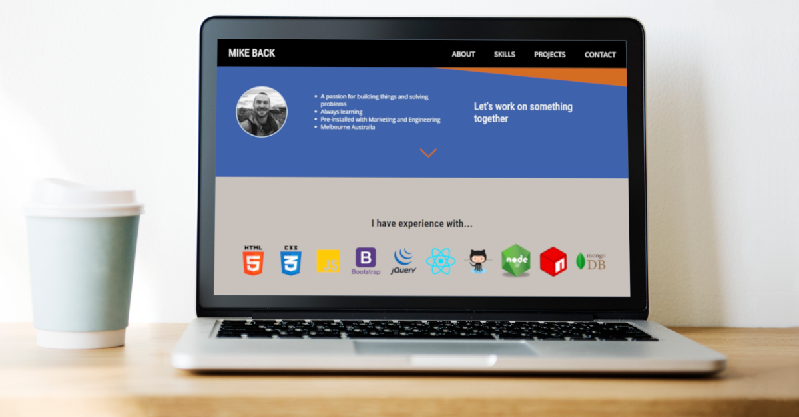

# Portfolio Site

Table of content

-  [Summary](#summary)
-  [Technology](#technology)
-  [Status](#status)
-  [License](#license)
-  [Live Site](#live-site)

## Summary

**My web developers portfolio site.** 
Originally built as the 5th and final project for the _Responsive Web Design_ course (freeCodeCamp). 
(See _freeCodeCampProject_ branch of this repo for submitted version.)

## Technology

 

This site is built with HTML and Sass and makes use of flexbox, CSS grid and media queries for a responsive display.

---

[][website]

---

## Status

## License

 
This project is licensed under the terms of the BSD 3-clause "New" or "Revised" license.

## Live Site

 
The master branch of this project is [deployed with Netlify.][website]

[website]: https://www.mikeback.me
