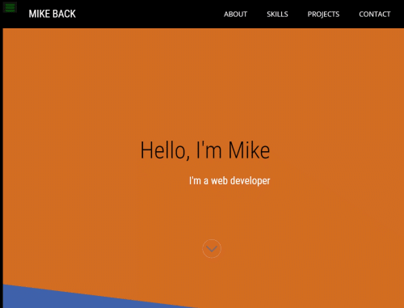

# Portfolio Site

**A web developers portfolio (mine!).** 
The 5th and final project for the _Responsive Web Design_ course (freeCodeCamp).

This site is built with plain css and html and makes use of flexbox, CSS grid and media queries for a responsive display.

___

### Visit Live Site

This branch is [deployed on GitHub Pages](https://makeitback.github.io/Portfolio-Site-fCC/) and incorporates the test script for freeCodeCamp (all tests passing!)

___

### License

This project is licensed under the terms of the BSD 3-clause "New" or "Revised" license. 
